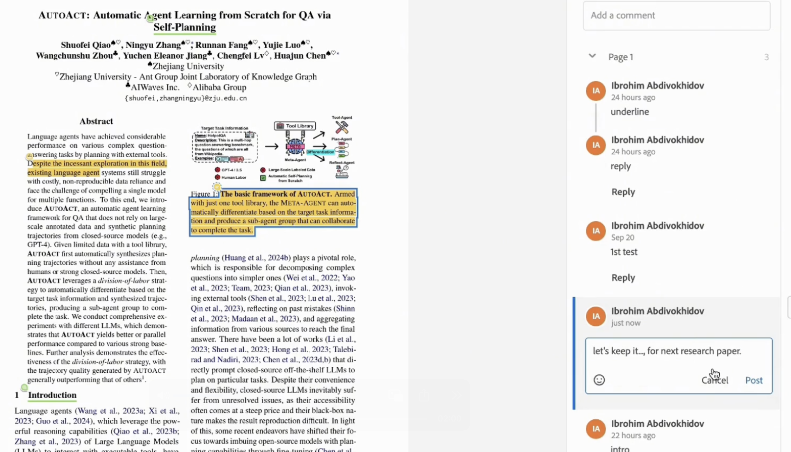
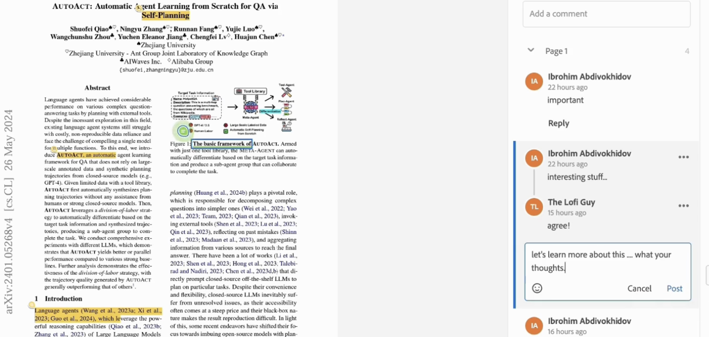
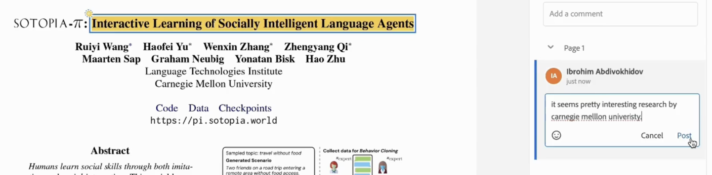
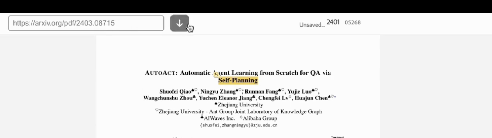
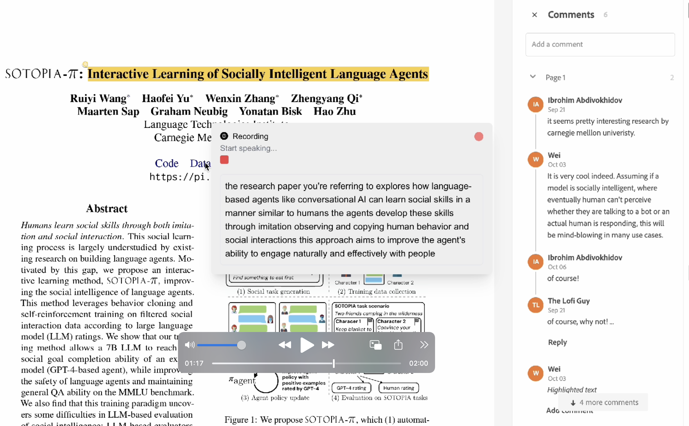
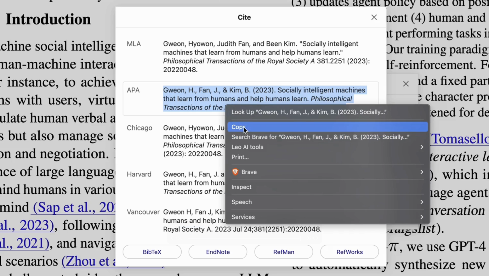

# Paper AI

Paper AI - the ultimate Open-source AI-powered research companion that streamlines literature reviews, enhances real-time collaboration, and offers a smart voice assistant to revolutionize your research experience.

> Kindly refer to the [INFO.md](https://github.com/abdibrokhim/paper-ai-voice-assistant/blob/main/INFO.md) file for more information about the project.

## 🚀 Watch on YouTube

How does it work?

[](https://youtu.be/59J436HLnkM?si=P3RxtpgyoQaXFhmX)

## 🐐 A couple of interesting stuff

Leave your notes in Private mode



Work together with peers in Collaborative mode



Highlight to Leave comments and Reply



Add new paper with ease



Advanced AI Voice Assistant to help you with your research



Citation made easy with Paper AI



### Try it now -> [Paper AI](https://paperai-web.vercel.app/)

### Check out the submission -> [ElevenLabs AI Audio Challenge](https://lablab.ai/event/elevenlabs-ai-audio-challenge/open-community/paper-ai)

### 🚀 Powered by AI/ML API
With AI/ML API I can access to over 200 AI models with one API endpoint. It's super cool! Now I can switch between models with just one click. 🔥 [Here's is how... click me](https://aimlapi.com/?via=ibrohim)

Step-by-Step tutorial available on [TUTORIAL.md](https://github.com/abdibrokhim/paper-ai-voice-assistant/blob/main/TUTORIAL.md)

## 📦 Run Locally

Clone the repository with:

```shell
git clone https://github.com/abdibrokhim/paper-ai-voice-assistant.git
```

Install the dependencies with:

```shell
npm install
```
and,

Copy the `.env.example` file to `.env` and fill in the required environment variables.

```shell
cp .env.example .env
```

Here you should put your stuff:
    
```shell
NEXT_PUBLIC_apiKey=...
NEXT_PUBLIC_authDomain=...
NEXT_PUBLIC_projectId=...
NEXT_PUBLIC_storageBucket=...
NEXT_PUBLIC_messagingSenderId=...
NEXT_PUBLIC_appId=...
NEXT_PUBLIC_measurementId=...
NEXT_PUBLIC_CLERK_PUBLISHABLE_KEY=pk_test_...
CLERK_SECRET_KEY=sk_test_...
NEXT_PUBLIC_CLERK_SIGN_IN_URL=/sign-in
NEXT_PUBLIC_CLERK_SIGN_UP_URL=/sign-up
NEXT_PUBLIC_ADOBE_CLIENT_ID=...
NEXT_PUBLIC_ELEVENLABS_API_KEY=sk_...
NEXT_PUBLIC_AIML_API_KEY=...
```

Check out the following tutorials to get started:

[How to get API Key from AI/ML API. Quick step-by-step tutorial with screenshots for better understanding.](https://medium.com/@abdibrokhim/how-to-get-api-key-from-ai-ml-api-225a69d0bb25)

[How to create account on Clerk and setup a new project.](https://medium.com/@abdibrokhim/how-to-create-account-on-clerk-and-setup-a-new-project-532be3545642)

Run the development server with:

```shell
npm run dev
```
Open http://localhost:3000 in your browser.

## 🦄 Important

if it was useful. Please consider [donate](https://buymeacoffee.com/abdibrokhim/). 

## 🥂 Discord bot

Join our community Discord server [Open Community](https://discord.gg/nVtmDUN2sR). 

We cook some cool stuff there. [imcook.in](https://imcook.in) with you guys. 🧑‍🍳

## 🐞 Bug report or Feature request

Message me at abdibrokhim@gmail.com

Or just create an issue over here.

## 👋 Want to Contribute?

Kindly check the [CONTRIBUTING.md](https://github.com/abdibrokhim/paper-ai-voice-assistant/blob/main/CONTRIBUTING.md)

## ⭐️ Star History

[](https://star-history.com/#abdibrokhim/paper-ai-voice-assistant&Date)

## 🙏 Support
If you wish to support further development and feel extra awesome, you can [Donate](https://buymeacoffee.com/abdibrokhim/), become a [Patron](https://www.patreon.com/abdibrokhim) or [Follow on LinkedIn](https://www.linkedin.com/in/abdibrokhim/).

## 🦄 Want to learn build stuff from coool guy?

Here's my topmate profile https://topmate.io/join/abdibrokhim book session with me. it's Absolutely FREE! 🎉 (free services for everyone , i want to help as much as people possible, so far i could help 200K developers, let's goooooo, [imcook.in](https://imcook.in))